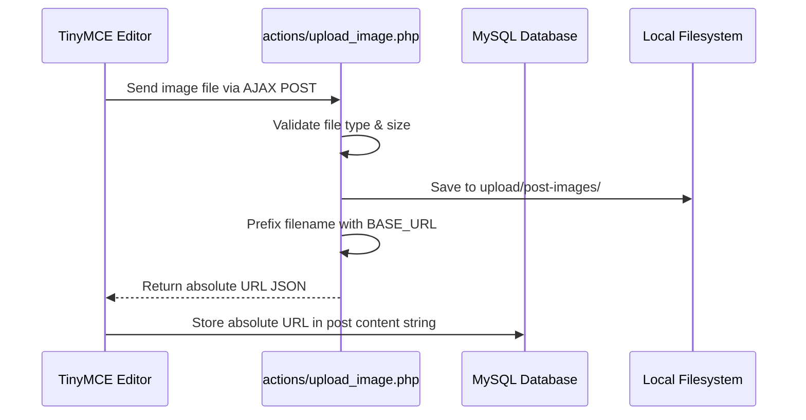
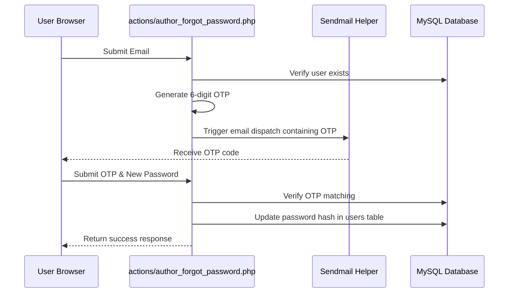

# Product Requirements Document (PRD): BlogFusion

This document outlines the detailed product requirements, system architecture, database schema, user flows, and quality checklists for the **BlogFusion** platform. It serves as a testing blueprint for developers, QA engineers, and automated test scripts to verify system behavior and locate bugs.

---

## 1. Executive Summary & Overview

### 1.1 Vision
BlogFusion is a multi-author blogging and engagement platform designed for publishers, writers, and readers. It offers a premium visual aesthetic (sleek layouts, glassmorphism, tailored color palettes) alongside robust administrative controls and writer analytics.

### 1.2 Tech Stack
*   **Backend**: PHP (Core)
*   **Database**: MySQL
*   **Frontend**: HTML5, Vanilla JavaScript, CSS, Tailwind CSS (CDN-based injection)
*   **Libraries**: Chart.js (v4.4.0), TinyMCE (Rich Text Editor)

---

## 2. User Roles & Permission Matrix

BlogFusion divides platform capabilities among three roles:

| Feature / Action | Reader (Guest/User) | Author | Admin |
| :--- | :---: | :---: | :---: |
| Read Posts | Yes | Yes | Yes |
| React & Comment on Posts | Yes | Yes | Yes |
| Create & Edit Own Posts | No | Yes | Yes (Any) |
| Manage Categories | No | No (Request only) | Yes (Direct) |
| View System-Wide Analytics | No | No | Yes |
| Manage System Users | No | No | Yes |
| Reply to Comments | No | Yes (Own posts) | Yes |

---

## 3. Database Architecture & Schema

The platform relies on the `blogfusion` database containing the following core tables:

### 3.1 `users`
Stores user profile, credentials, and roles.
*   `id` (INT, Primary Key, Auto-increment)
*   `name` (VARCHAR)
*   `email` (VARCHAR, Unique)
*   `password` (VARCHAR, hashed via PHP `password_hash`)
*   `role` (ENUM: `'member'`, `'author'`, `'admin'`)
*   `profile_image` (VARCHAR)
*   `created_at` (TIMESTAMP)

### 3.2 `posts`
Holds articles and publishing states.
*   `id` (INT, Primary Key, Auto-increment)
*   `author_id` (INT, Foreign Key -> `users.id`)
*   `category_id` (INT, Foreign Key -> `categories.id`)
*   `title` (VARCHAR)
*   `slug` (VARCHAR, Unique slug for clean SEO links)
*   `image` (VARCHAR, Post cover image path)
*   `content` (TEXT, Rich Text Content from TinyMCE)
*   `views` (INT, default 0)
*   `status` (ENUM: `'published'`, `'draft'`, `'pending'`, `'review'`, `'rejected'`)
*   `created_at` (TIMESTAMP)

### 3.3 `categories`
Organizes posts into segments.
*   `id` (INT, Primary Key, Auto-increment)
*   `name` (VARCHAR)
*   `slug` (VARCHAR, Unique)
*   `created_at` (TIMESTAMP)

### 3.4 `comments`
Readers' feedback on posts.
*   `id` (INT, Primary Key, Auto-increment)
*   `user_id` (INT, Foreign Key -> `users.id`)
*   `post_id` (INT, Foreign Key -> `posts.id`)
*   `comment` (TEXT)
*   `created_at` (TIMESTAMP)

### 3.5 `reactions`
Engagement tracking on posts.
*   `id` (INT, Primary Key, Auto-increment)
*   `user_id` (INT, Foreign Key -> `users.id`)
*   `post_id` (INT, Foreign Key -> `posts.id`)
*   `emoji` (VARCHAR: e.g., `'👍'`, `'❤️'`, `'😮'`, `'😂'`, `'😢'`, `'😡'`)
*   `created_at` (TIMESTAMP)

### 3.6 `notifications`
System alerts for users (e.g., status changes, replies).
*   `id` (INT, Primary Key, Auto-increment)
*   `user_id` (INT, Foreign Key -> `users.id` ON DELETE CASCADE)
*   `title` (VARCHAR)
*   `message` (TEXT)
*   `type` (VARCHAR)
*   `is_read` (TINYINT, default 0)
*   `created_at` (TIMESTAMP)

---

## 4. Key Functional Requirements & Features

### 4.1 Authentication & Security

#### 4.1.1 Registration & Login
*   **Register (`pages/register.php`)**: Validates name, unique email, and passwords. Hashes credentials safely.
*   **Login (`pages/login.php`)**: Verifies password against hash and stores role and user details in active session variables (`$_SESSION['user_id']`, `$_SESSION['role']`).
*   **Session Checks (`include/session.php`)**: Checks and enforces login levels (`requireUser()`, `requireAuthor()`, `requireAdmin()`) at the top of protected pages. Rejects unauthorized access with redirects to the login screen.

#### 4.1.2 Password Reset (OTP-based)
*   **Login Prompt**: "Forgot password?" redirects to `pages/forgot-password.php`.
*   **Step 1 (OTP Send)**: User inputs email. System verifies email, generates a 6-digit OTP, mails it to the user, and transitions to Step 2.
*   **Step 2 (OTP Verify & Reset)**: User submits the OTP alongside their new password. System resets the password and displays a success toast.
*   **Author Profile Modal (`author/profile.php`)**: Features an in-panel reset option inside the "Change Password" modal using AJAX flows mapped to `actions/author_forgot_password.php` and `actions/author_password_otp.php`.

---

### 4.2 Admin Management Suite

#### 4.2.1 Dashboard (`admin/dashboard.php`)
*   **Aggregated Counters**: Total Users, Total Posts, Categories, Comments. Displays growth metrics comparing current month vs previous month.
*   **Recent Activity**: Real-time list of combined comments and signups sorted chronologically.
*   **Site Traffic Chart**: A line chart pre-populated for the last 6 calendar months showing page views.
*   **Author Leaderboard**: Ranks authors by aggregate views.

#### 4.2.2 Posts & Editor
*   **Management Grid (`admin/posts.php`)**: Lists all posts in a table with search, pagination, status toggles, and delete options equipped with Toast messages.
*   **Create/Edit Post (`admin/edit-post.php`)**: Rich editor integrating TinyMCE. Configured to prevent relative image path conversion, ensuring images are stored with full `BASE_URL` qualifiers in the DB.

#### 4.2.3 Category Controls (`admin/categories.php`)
*   Add, edit, and delete category structures. Validates slug uniqueness during updates.

#### 4.2.4 User Profiles & Statuses (`admin/users.php`)
*   Listings with roles (Admin, Author, Member) and active toggle states (enable/disable user access).

#### 4.2.5 Reactions Dashboard (`admin/reactions.php`)
*   Aggregate stats (Total, Average, Top Emoji, Most Reacted Post).
*   Line chart mapping reactions trends (Hourly, Daily, or Monthly based on the selected range filter: `24h`, `7d`, `30d`, `all`).
*   Doughnut chart detailing distribution percentages for emojis.

#### 4.2.6 Analytics Panel (`admin/analytics.php`)
*   12-month views, users, posts, and comments charts mapping system performance.

---

### 4.3 Author Workspace

#### 4.3.1 Author Dashboard (`author/index.php`)
*   Renders writer-centric stats (Aggregate Views, Comments, Reactions, Shares) and a detailed feed of recent feedback.

#### 4.3.2 Author Analytics (`author/analytics.php`)
*   Detailed graphs mapping views trends, post outputs, and category distributions.

#### 4.3.3 Category Request Panel (`author/request-category.php`)
*   Allows authors to submit recommendations for new categories with justification.
*   Displays request records in a responsive list featuring collapsible details rows.

#### 4.3.4 Notifications Feed (`author/notifications.php`)
*   Collects and displays system-triggered alerts. Supports marking messages as read or deleting notifications.

---

### 4.4 Reader Platform

#### 4.4.1 Feed & Articles (`pages/home.php`)
*   Shows active, published posts. Supports pagination and category filtering.

#### 4.4.2 Single Post Redirects
*   **Single-Post URL**: Whenever a single-post view is triggered (`pages/single-post.php`), it redirects through `redirect-post.php` containing the `post_id` to log view metrics securely before displaying the content.

#### 4.4.3 Interaction Modules
*   **Comments**: Allows logged-in users to submit text comments.
*   **Reactions**: Renders quick emoji buttons for reacting. AJAX handlers process state changes dynamically.

---

## 5. System Data Flow Diagrams

### 5.1 Article Image Upload Flow

### 5.2 Password Reset OTP Flow

---

## 6. QA & Bug-Hunting Verification Checklist

Use this checklist to verify correct system functionality and discover defects:

### 6.1 Data Integrity Checks
- [ ] **Image Upload Path**: Insert an image via TinyMCE editor. Save the post. Inspect the MySQL `posts` table content column. Ensure image paths start with `https://blogfusion.xo.je/` and **never** contain relative notation like `../upload/...`.
- [ ] **Slug Uniqueness**: Attempt to create a category or post with an identical name/title. Verify that the system dynamically appends a unique tag or rejects the duplicate with a descriptive validation error rather than triggering a database crash.

### 6.2 Visual and Chart Correctness
- [ ] **Line Chart Continuity**: Ensure that when a month has zero views or reactions, the line charts (`admin/dashboard.php`, `admin/reactions.php`) render a continuous line touching `0` for that month on the x-axis, rather than breaking the line or displaying a single isolated dot.
- [ ] **Dark Mode Adaptation**: Toggle dark mode in the Admin and Author panels. Ensure charts (gridlines, tooltips, ticks) adjust color dynamically for optimal contrast and readability.

### 6.3 Security Controls
- [ ] **URL Access Bypass**: Copy the URL of an admin page (e.g. `admin/users.php`). Log out or log in as a member. Paste the URL. Verify that access is denied and redirects the browser back to `pages/login.php`.
- [ ] **Session Hijacking Checks**: Attempt to pass a raw script tag `` inside comment fields, user name inputs, or post titles. Verify that characters are rendered safely using `htmlspecialchars` during output.
